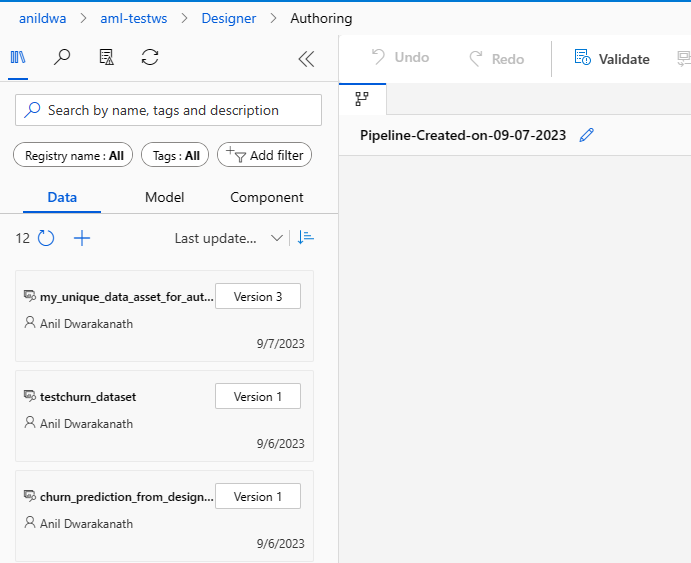
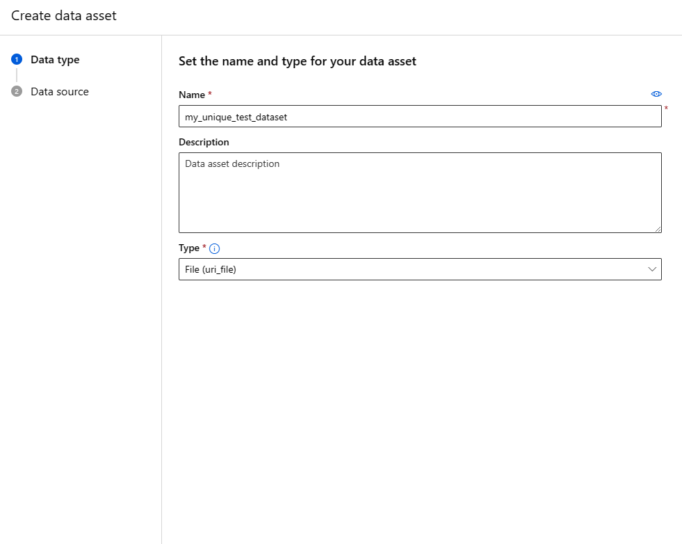
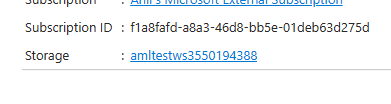

### Automl and Scoring with UI

In this section, we will use Automl UI to create a training job and AML Visual Designer to score using the best performaning model created by Automl. 

#### Create a Automl Training Job

Make sure a compute cluster is provisioned. 

##### Please follow the steps to configure and submit an Automl Training Job.
- Navigate to https://ml.azure.com and login with you credentials. 
- Select the workspace and navigate to Automated ML tab. 

- Select New Automated ML job

- Provide a unique job name For e.g my_unique_name_automl_job
- Select "Create New" under experiment name and provide a unique experiment name and click next. For e.g my_unique_name_experiment.

- Select Classification as Task type.

- In the Select dataset, select Create

- Provide unique name for the Data asset. For e.g my_unique_data_asset_for_automl and select Type as Table(mltable) and click Next

- Select From local files and click next. 
- Select Datastore Type as Azure Blob Storage and select workspaceblobstore and click next. 
- Click Upload Folder and point to the AutomlTrainingData folder under this repo. 

- Click Next and Click Create. This should a new Data set in the AML workspace. 

- In the Automl page, select the newly created dataset and click Next.

- Under Task settings, select Target Column Churn
- Click additional configuration settings and provide details as shown below and click Save.
 
- Enable early termination. This is to reduce training time if the scores do not improve. 
Click Next. 

- Under Compute, select compute type as Compute Cluster and select the AML compute cluster that has been provisioned and click Next.

- Click Submit Training job. The job can around 12 minutes on a 2-core training cluster. Please wait for the job to complete successfully. 

- Navigate to Job panel in AML workspace to see the status of the training job. 

- Click on Models tab to view the best performing model and view explainations and other metrics. 

- Click on Register Model Tab 

- Click Next

- Provide unique model name and version and Click Next. For e.g my_unique_best_performing_model. 

- Click Register.

- Once the model is registered, you can find it in the Models Pane in AML. 

#### Using Visual Designer to Score using the best performing model. 

##### Prerequisites
- Navigate to Components pane in AML. 

- Click on New Component and select Folder in the Upload Component page. 

- Click Browse and point to score-component from this repo and upload the contents of the score-component. This folder has code to score the the test data using the best performing model. 

- Click Next to create the component

##### Create scoring job using Visual Designer. 

- Navigate to Designer pane in AML and select Custom tab.

- Create new pipeline using Custom components button
- On the Authoring page, select Data tab and click on the + button to add a new test dataset. 

- In the Create data assest page, provide a unique Data asset name. For e.g. my_unique_test_dataset.
Select Type as File and click Next.

- Select From local files, click Next, Select Azure Blob Storage and workspaceblobstore. 

- Click Upload File and point to the WA_Fn-UseC_-Telco-Customer-Churn_Test.csv file in the telcocustomerchurn folder in the repo. Click Next once the file is uploaded.
- Click Create to create the data set. 

- Drag and Drop the new created my_unique_test_dataset on the Authoring canvas. 

- Click on Model Tab and Drag and Drop the my_unique_best_performing_model on to the Authoring Canvas. 

- Click on the Component Tab and Drag and drop the Score component that was just uploaded. 

- Connect the Dataset to the input_data port of the Score component and Model to the input_model port of the component. 

- Click on the Properties icon on the top right corner in the Authoring canvas. 

- Expand Output section and provide unique name in the Path Field. For e.g azureml/my_unique_folder_name/

- Click on Configure & Submit on the top right corner. 

- Provide new experiment name and job display name and click Next and Next. For e.g. my_unique_designer_experiment.

- On the Runtime Settings page, select compute cluster and select the provisioned compute cluster. Click Next.

- Click Submit to create the experiment. Please wait for the Job to complete, by Navigating to the Jobs Page in AML. 

- Once the Job complete, to view the Scoring results, naviate to the Azure Portal from the AML workspace top right corner. 

Click on "View all properties in Azure Portal".  This will open the Azure Poral in a new browser tab. 
- In the Azure portal, click on the Storage link in the AML workspace overview panel. 

- Navigate to Containers tab.

- Navigate to the azureml-blobstore-{{some-guid}} folder. Type the folder path in the search box. For e.g azureml/my_unique_folder_name/. This is the name of the folder path provided in the Designer page. 

- Download the file to review the Churn Prediction Results. 

